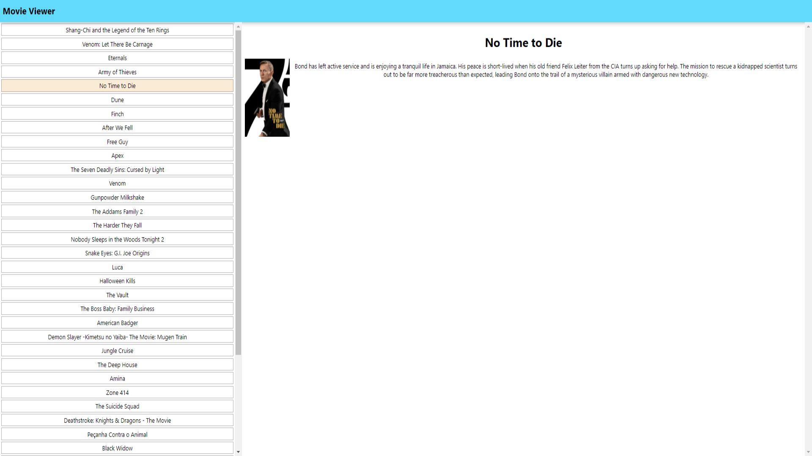

# Movie Viewer

## Available Scripts

In the project directory, you can run:

### `npm start`

## Usage

The user can see on the left side a list of movies and on right side the details of a movie.
The user can choose to see the details of a movie by clicking on.
If the user scrolls down new pages of movies will be shown. 

## Screenshots 

